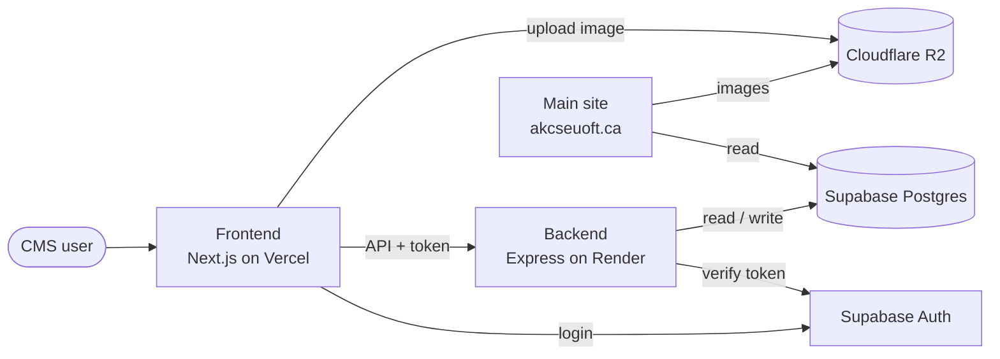
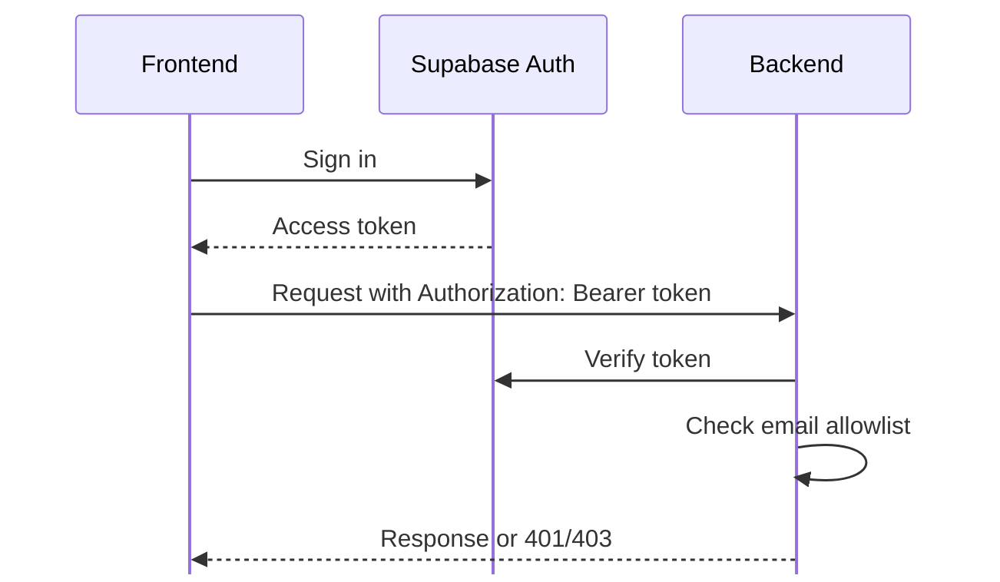
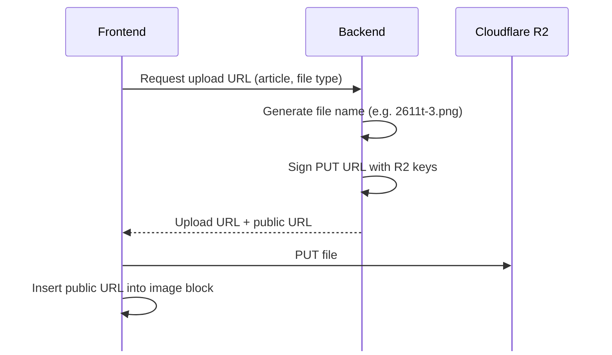
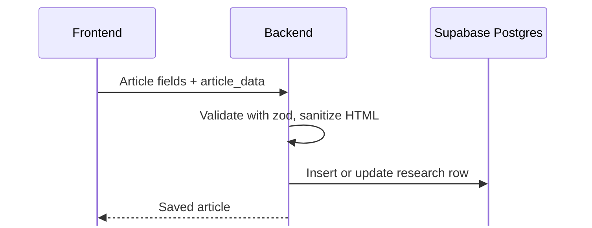

# Architecture

```mermaid
flowchart LR
  user([CMS user]) --> fe[Frontend<br/>Next.js on Vercel]
  fe -- login --> auth[Supabase Auth]
  fe -- API + token --> be[Backend<br/>Express on Render]
  be -- verify token --> auth
  be -- read / write --> db[(Supabase Postgres)]
  fe -- upload image --> r2[(Cloudflare R2)]
  site[Main site<br/>akcseuoft.ca] -- read --> db
  site -- images --> r2
```

## Login

```mermaid
%%{init: {"sequence": {"mirrorActors": false}}}%%
sequenceDiagram
  participant FE as Frontend
  participant SA as Supabase Auth
  participant BE as Backend
  FE->>SA: Sign in
  SA-->>FE: Access token
  FE->>BE: Request with Authorization: Bearer token
  BE->>SA: Verify token
  BE->>BE: Check email allowlist
  BE-->>FE: Response or 401/403
```

## Image upload

```mermaid
%%{init: {"sequence": {"mirrorActors": false}}}%%
sequenceDiagram
  participant FE as Frontend
  participant BE as Backend
  participant R2 as Cloudflare R2
  FE->>BE: Request upload URL (article, file type)
  BE->>BE: Generate file name (e.g. 2611t-3.png)
  BE->>BE: Sign PUT URL with R2 keys
  BE-->>FE: Upload URL + public URL
  FE->>R2: PUT file
  FE->>FE: Insert public URL into image block
```

## Saving an article

```mermaid
%%{init: {"sequence": {"mirrorActors": false}}}%%
sequenceDiagram
  participant FE as Frontend
  participant BE as Backend
  participant DB as Supabase Postgres
  FE->>BE: Article fields + article_data
  BE->>BE: Validate with zod, sanitize HTML
  BE->>DB: Insert or update research row
  BE-->>FE: Saved article
```
